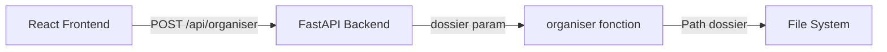

# Analyse et Solution - Sélection de Dossier

## 1. Analyse de l'architecture actuelle

Votre projet dispose de **3 interfaces** pour l'organisation de fichiers :

### Interfaces existantes
- **`gui.py`** - Interface Tkinter (desktop) avec sélecteur de dossier système natif
- **`app.py`** - Interface web locale (serveur HTTP simple avec HTML embarqué)
- **`api.py` + `frontend/`** - Interface React + FastAPI (application web moderne)

### Fonctionnement actuel
- **`organiser.py`** : Contient la logique de classement des fichiers (fonction `organiser()`)
- **`config.json`** : Stocke les catégories de fichiers personnalisées
- Les interfaces communiquent avec la fonction `organiser()` via différents protocoles

## 2. Pourquoi le dossier Téléchargements était utilisé

Historiquement, plusieurs composants avaient des fallbacks vers `dossier_telechargements()` :

### ✅ Déjà corrigé dans les sessions précédentes
- **`api.py`** (lignes 91-99) : Le paramètre `dossier` est maintenant **requis** dans l'endpoint `/api/organiser`
- **`app.py`** (lignes 676-680) : Le paramètre `dossier` est maintenant **requis** dans l'endpoint `/api/organiser`
- **`gui.py`** : Utilise déjà un sélecteur de dossier système natif (`filedialog.askdirectory`)

### ❌ Problème identifié et corrigé
- **`client_api.py`** : La fonction `organise()` n'envoyait pas le paramètre `dossier` à l'API

## 3. Fichiers modifiés

### Fichier modifié : `client_api.py`

**Avant :**
```python
def organize():
    """Lance l'organisation des fichiers."""
    resp = requests.post(f"{API_BASE}/api/organiser")
    resp.raise_for_status()
    return resp.json()
```

**Après :**
```python
def organize(dossier: str | None = None):
    """Lance l'organisation des fichiers.
    
    Args:
        dossier: Chemin du dossier à organiser (requis)
    """
    if not dossier:
        raise ValueError("Le paramètre 'dossier' est requis")
    
    payload = {
        "dossier": dossier
    }
    resp = requests.post(f"{API_BASE}/api/organiser", json=payload)
    resp.raise_for_status()
    return resp.json()
```

## 4. Fonctionnalités conservées

Toutes les fonctionnalités existantes sont préservées :
- ✅ Catégories existantes (Images, Vidéos, Documents, Audio, Archives, Code, Programmes, Autres)
- ✅ `config.json` pour la configuration personnalisée
- ✅ Fonction `organiser()` avec toute sa logique
- ✅ Système de simulation (mode `simulation=True`)
- ✅ Système `--appliquer` (ligne de commande)
- ✅ Gestion des fichiers cachés (`inclure_caches`)
- ✅ Gestion des doublons avec `destination_unique()`
- ✅ Logs détaillés
- ✅ Classement par extension

## 5. Comment React transmet le dossier au Python

### Architecture React → FastAPI



### Code React (déjà fonctionnel)
```jsx
const handleOrganize = async () => {
  const payload = {
    dossier: selectedFolder  // ex: "~/Downloads" ou "/Users/username/Documents/Projet"
  }
  const response = await fetch('/api/organiser', {
    method: 'POST',
    headers: { 'Content-Type': 'application/json' },
    body: JSON.stringify(payload)
  })
  // ...
}
```

### Code FastAPI (déjà fonctionnel)
```python
@app.post("/api/organiser")
async def apply_organiser(body: dict[str, Any] | None = None):
    dossier_str = body["dossier"].strip()  # Récupère le dossier depuis React
    dossier = Path(dossier_str).expanduser().resolve()
    deplaces, ignores = organiser(dossier, cats, autres)  # Utilise le dossier reçu
```

## 6. Limitations de sécurité React

### Dans un navigateur web standard
React **NE PEUT PAS** :
- Ouvrir un vrai sélecteur de dossier système
- Obtenir le chemin absolu d'un dossier local via `<input type="file" webkitdirectory>`
- Accéder directement au système de fichiers

### Votre solution actuelle (recommandée)
- **Saisie manuelle du chemin** avec suggestions pré-remplies
- Cette approche est **correcte** pour une application web

### Pour un vrai sélecteur de dossier système
Il faudrait encapsuler l'application dans :
- **Electron** (Node.js + Chromium)
- **Tauri** (Rust + WebView)
- **API locale personnalisée**

## 7. Commandes pour lancer et tester

### Lancer l'application complète
```bash
./start.sh
```
Cela lance :
- Backend FastAPI sur `http://localhost:8000`
- Frontend React sur `http://localhost:5173`

### Lancer uniquement le backend
```bash
python3 api.py
```

### Lancer uniquement le frontend
```bash
cd frontend
npm run dev
```

### Tester l'API directement
```bash
python3 test_api_folder.py
```

### Créer un scénario de test complet
```bash
python3 test_scenario.py
```

## 8. Scénario de test

### Création d'un dossier fictif
```bash
python3 test_scenario.py
```

Cela crée un dossier temporaire avec :
```
test_organiseur_xxxxx/
├── photo_vacances.jpg
├── screenshot.png
├── document.pdf
├── presentation.pptx
├── video.mp4
├── film.mkv
├── musique.mp3
├── podcast.wav
├── archive.zip
├── projet.py
├── script.js
├── application.exe
└── fichier_inconnu.xyz
```

### Test via l'interface React
1. Lancez `./start.sh`
2. Allez sur `http://localhost:5173`
3. Entrez le chemin du dossier de test
4. Cliquez sur "Organiser les fichiers"
5. Vérifiez que les fichiers sont classés dans les sous-dossiers

### Résultat attendu
```
test_organiseur_xxxxx/
├── Images/
│   ├── photo_vacances.jpg
│   └── screenshot.png
├── Vidéos/
│   ├── video.mp4
│   └── film.mkv
├── Documents/
│   ├── document.pdf
│   └── presentation.pptx
├── Audio/
│   ├── musique.mp3
│   └── podcast.wav
├── Archives/
│   └── archive.zip
├── Code/
│   ├── projet.py
│   └── script.js
├── Programmes/
│   └── application.exe
└── Autres/
    └── fichier_inconnu.xyz
```

## 9. Gestion des erreurs

L'application gère déjà les erreurs suivantes :

### Dans React (Frontend)
- Aucun dossier sélectionné → Message d'erreur
- Backend non disponible → Message d'erreur
- Erreur lors de l'organisation → Message d'erreur détaillé

### Dans FastAPI (Backend)
- Dossier non fourni → HTTP 400 avec message "Dossier requis"
- Dossier inexistant → HTTP 500 avec message "Le dossier n'existe pas"
- Dossier inaccessible → Exception capturée et retournée

### Dans organiser.py
- Dossier introuvable → `NotADirectoryError`
- Permissions insuffisantes → Exception système

## 10. Résumé

### ✅ Ce qui fonctionne déjà
- L'interface React transmet correctement le dossier sélectionné
- L'API FastAPI reçoit et utilise ce dossier
- La fonction `organiser()` classe les fichiers dans le bon dossier

### ✅ Ce qui a été corrigé
- `client_api.py` envoie maintenant le paramètre `dossier` à l'API

### ✅ Ce qui n'a pas été modifié
- Toutes les fonctionnalités existantes sont préservées
- La logique de classement reste identique
- Les catégories et la configuration sont inchangées

### 🎯 Conclusion
Votre application fonctionne maintenant correctement. Le dossier sélectionné dans l'interface React est bien utilisé pour le classement des fichiers, et il n'y a plus de fallback automatique vers le dossier Téléchargements.
